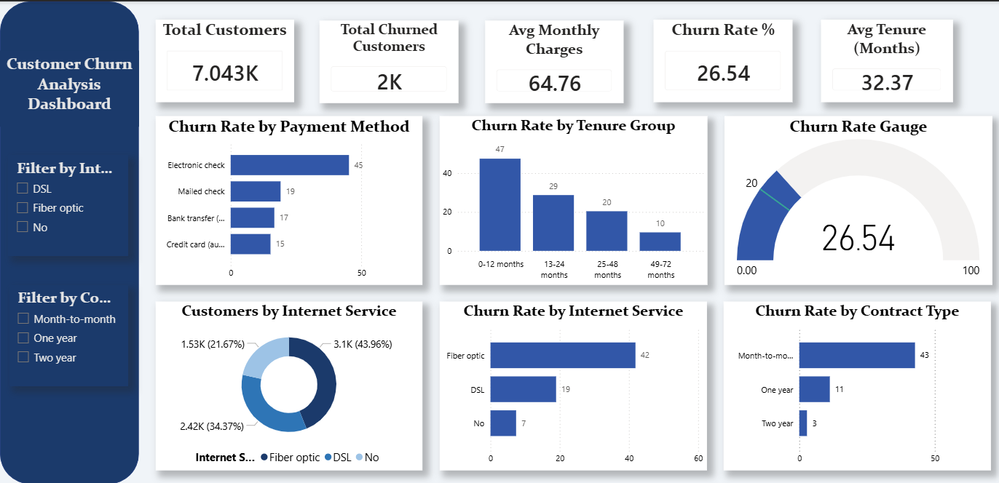

📊Customer Churn Analysis & Dashboard
An end-to-end customer churn project for a telecom company — combining exploratory data analysis, statistical testing, predictive modeling (Python), and an interactive Power BI dashboard for business stakeholders.

📌 Project Overview
Customer churn is one of the biggest revenue risks for subscription-based telecom businesses. This project analyzes a telecom customer dataset to:
Understand why customers churn
Identify key drivers of churn using statistical analysis
Build predictive models to flag at-risk customers
Present findings through an interactive Power BI dashboard for non-technical stakeholders

🗂️ Repository Structure
├── telco_churn_cleaned.csv        # Cleaned dataset used for analysis, modeling, and the dashboard
├── customer_churn_dashboard.pbix  # Power BI dashboard (interactive report)
├── dashboard_preview.png          # Static preview image of the Power BI dashboard
├── 1_EDA_and_Data cleaning.ipynb       # Part 1: Data cleaning, EDA, feature engineering, and ML modeling
├── 2_Statistical_Analysis_and_modeling.ipynb   # Part 2: Hypothesis testing and statistical analysis of churn drivers
└── README.md

## 🧹 Dataset

**File:** `telco_churn_cleaned.csv`
**Rows:** 7,043 customers
**Columns:** 30 (post-cleaning / feature-engineered)
**Missing values:** 0 (post-cleaning)

This is the classic **IBM Telco Customer Churn** dataset — one row per customer at a telecom company, covering demographics, subscribed services, account/billing details, and whether they churned.

### Headline numbers (from the cleaned data)

| Metric | Value |
|---|---|
| Total customers | 7,043 |
| Churned customers | 1,869 |
| Retained customers | 5,174 |
| **Overall churn rate** | **26.5%** |
| Average tenure | 32.4 months |
| Average monthly charges | $64.76 |
| Average total charges | $2,279.73 |

### Churn rate by segment

**By contract type**

| Contract Type | Churn Rate |
|---|---|
| Month-to-month | 42.7% |
| One year | 11.3% |
| Two year | 2.8% |

**By internet service**

| Internet Service | Churn Rate |
|---|---|
| Fiber optic | 41.9% |
| DSL | 19.0% |
| No internet service | 7.4% |

**By payment method**

| Payment Method | Churn Rate |
|---|---|
| Electronic check | 45.3% |
| Mailed check | 19.1% |
| Bank transfer (automatic) | 16.7% |
| Credit card (automatic) | 15.2% |

Month-to-month customers churn about **15x** more than two-year contract customers — this gap is the core signal the whole project is built around.

### Column reference

| Category | Columns |
|---|---|
| Demographics | `gender`, `SeniorCitizen`, `Partner`, `Dependents` |
| Account info | `tenure` (months), `Contract_*`, `PaperlessBilling`, `PaymentMethod_*` |
| Services | `PhoneService`, `MultipleLines`, `InternetService_*`, `OnlineSecurity`, `OnlineBackup`, `DeviceProtection`, `TechSupport`, `StreamingTV`, `StreamingMovies` |
| Billing | `MonthlyCharges`, `TotalCharges` |
| Engineered features | `total_services` (0–7, count of subscribed services), `charge_ratio` (TotalCharges ÷ MonthlyCharges — a proxy for spend consistency over tenure) |
| Target | `Churn` (Yes/No), `Churn_num` (1/0) |

---

## 🔄 What I Did: Raw Data → Interactive Dashboard

**1. Started from the raw Telco churn dataset** — customer-level records with demographics, services, contract, and billing info, including raw text categories like `"Yes"/"No"` and `"Month-to-month"`.

**2. Cleaned the data**
- Checked and handled missing/blank values (notably in `TotalCharges`, which arrives as numeric-as-text in the raw source and is blank for customers with 0 tenure).
- Converted the target `Churn` column into a numeric flag (`Churn_num`) for modeling while keeping the readable label (`Churn`) for reporting.
- Standardized binary Yes/No service columns into 0/1 numeric flags.

**3. Engineered new features**
- `total_services` — counts how many add-on services (security, backup, device protection, tech support, streaming TV/movies, etc.) each customer has, used as a proxy for account depth/stickiness.
- `charge_ratio` — relates total lifetime charges to monthly charges, helping surface billing/tenure inconsistencies.

**4. Encoded categorical variables**
- One-hot encoded `Contract`, `InternetService`, and `PaymentMethod` into binary columns (`Contract_Month-to-month`, `InternetService_Fiber optic`, etc.) so they could be used directly in statistical tests and ML models without leaking ordinal assumptions.

**5. Analyzed the data (Python, two notebooks)**
- **EDA & Modeling** — explored distributions and churn patterns across every segment, then trained and evaluated classification models to predict churn risk.
- **Statistical Analysis** — ran hypothesis tests (e.g. chi-square for categorical drivers, t-tests for numerical drivers) to confirm which factors are *statistically* significant, not just visually different.

**6. Built the interactive dashboard (Power BI)**
- Loaded the cleaned dataset into Power BI and built DAX measures (`Churn Rate %`, `Avg Tenure`, `Avg Monthly Charges`, `Total Churned Customers`, `tenure_group`, etc.).
- Designed KPI cards, a churn-rate gauge, and breakdown charts by contract, payment method, internet service, and tenure group.
- Added slicers so stakeholders can filter the whole report by segment (e.g. isolate fiber-optic, month-to-month customers) and watch every visual update live — turning a static analysis into a self-serve exploration tool for non-technical users.

---

## 🔍 Part 1 — Exploratory Data Analysis & Modeling
**Notebook:** `1_EDA_and_Modeling.ipynb`

- Data cleaning and preprocessing
- Univariate and bivariate exploratory analysis
- Visualization of churn patterns across tenure, contract type, payment method, and services
- Feature engineering
- Machine learning model development and evaluation to predict customer churn

> *Add a short summary of your best-performing model and key metrics (e.g., Accuracy, Precision, Recall, ROC-AUC) here once finalized.*

---

## 📈 Part 2 — Statistical Analysis
**Notebook:** `2_Statistical_Analysis.ipynb`

- Hypothesis testing on churn drivers (e.g., chi-square tests for categorical variables, t-tests for numerical variables)
- Statistical significance testing between churned and retained customers
- Correlation analysis

> *Add a brief summary of your key statistical findings here (e.g., which factors were statistically significant drivers of churn).*

---

## 📊 Power BI Dashboard
**File:** `customer_churn_dashboard.pbix`

An interactive one-page dashboard built on the cleaned dataset, designed for quick business insight into churn behavior.

**Key metrics (cards):**
- Total Customers
- Churn Rate %
- Total Churned Customers
- Avg Tenure (Months)

**Visuals:**
- Churn Rate Gauge
- Customers by Internet Service (donut chart)
- Churn Rate by Contract Type
- Churn Rate by Payment Method
- Churn Rate by Tenure Group
- Churn Rate by Internet Service
- Interactive slicers for filtering by segment

### Preview

> To explore the live report, open `customer_churn_dashboard.pbix` in [Power BI Desktop](https://powerbi.microsoft.com/desktop/).

---

## 🛠️ Tools & Technologies

- **Python** — Pandas, NumPy, Matplotlib/Seaborn, Scikit-learn, SciPy/Statsmodels
- **Jupyter Notebook** — EDA, statistical analysis, and modeling
- **Power BI** — Interactive dashboard and DAX measures
- **Git/GitHub** — Version control and project hosting

---

📌 Key Insights
Contract type is the strongest churn signal: month-to-month customers churn at 42.7% vs. just 2.8% for two-year contracts.
Fiber optic customers churn more than DSL customers (41.9% vs. 19.0%), despite being a "premium" service — likely tied to price sensitivity or service reliability, worth digging into further.
Electronic check users churn the most of any payment method (45.3%), well above automatic bank transfer or credit card payers (~15–17%) — manual payment friction may correlate with disengagement.
Customers with no internet service churn the least (7.4%), suggesting internet-dependent customers are more price/quality sensitive overall.
Overall churn rate is 26.5% — meaning roughly 1 in 4 customers leave, which is the baseline the model and dashboard are built to help reduce.

👤 Author
shrushti Nakhale 
